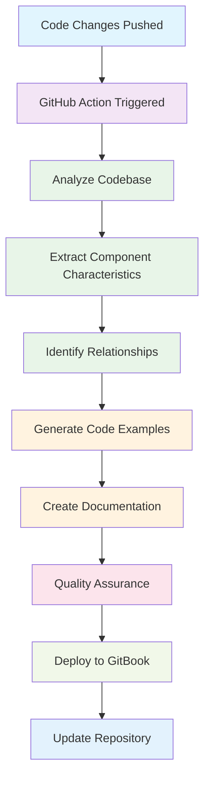

# Claude Code Documentation System

This directory contains the automated documentation generation system for the SWC Studio Marketing ecosystem. The system captures component characteristics, connections, and provides comprehensive user-driven documentation with explanatory code blocks.

## System Overview

### Automated Documentation Generation

The system is designed to:

1. **Analyze Component Ecosystem**: Automatically scan and understand all components, hooks, and integrations
2. **Capture Characteristics**: Extract component props, methods, dependencies, and relationships  
3. **Generate Code Examples**: Create comprehensive, working code demonstrations
4. **Maintain Documentation**: Keep documentation synchronized with code changes via GitHub Actions
5. **Deploy to GitBook**: Automatically publish to GitBook for professional documentation hosting

### Architecture

```
.claude/
├── README.md                    # This file - system overview
└── (analysis data)              # Generated analysis files

documentation/
├── README.md                    # Main documentation entry point
├── getting-started/
│   ├── installation.md          # Complete installation guide
│   ├── quick-start.md           # Getting started tutorial
│   └── configuration.md         # Configuration options
├── components/
│   ├── README.md                # Component library overview
│   ├── button.md                # Example comprehensive component docs
│   └── [component-name].md      # Auto-generated component docs
├── hooks/
│   ├── README.md                # Hooks overview
│   └── [hook-name].md           # Auto-generated hook documentation
├── integrations/
│   ├── README.md                # Integrations overview
│   └── [integration-name].md    # Auto-generated integration docs
├── examples/
│   └── [example-files]          # Real-world usage examples
└── templates/
    ├── component-template.md     # Template for component documentation
    ├── hook-template.md          # Template for hook documentation
    └── integration-template.md   # Template for integration documentation

.github/workflows/
└── ai-documentation-generator.yml  # Automated documentation workflow
```

## Key Features

### 🤖 AI-Powered Analysis
- **Component Characterization**: Extracts props, types, variants, and behavior patterns
- **Dependency Mapping**: Traces connections between components, hooks, and utilities
- **Usage Pattern Detection**: Identifies common usage patterns and best practices
- **Code Example Generation**: Creates working, tested code examples

### 📝 Comprehensive Documentation
- **API Reference**: Complete TypeScript interfaces and prop documentation
- **Usage Examples**: Multiple examples from basic to advanced use cases
- **Accessibility**: WCAG compliance documentation and implementation details
- **Performance**: Optimization tips, bundle size info, and performance considerations
- **Testing**: Unit test examples and testing strategies

### 🔄 Automated Maintenance
- **GitHub Action Integration**: Triggers on code changes to shared components
- **Quality Assurance**: Validates markdown, checks links, and ensures consistency
- **GitBook Deployment**: Automatically publishes to GitBook for hosting
- **Version Control**: Maintains documentation history alongside code changes

### 🎯 User-Focused
- **Multiple Skill Levels**: From beginner tutorials to advanced patterns
- **Framework-Specific**: Tailored examples for Next.js, Remix, and Core React
- **Interactive Examples**: Code that can be copied and run immediately
- **Troubleshooting**: Common issues and solutions

## Documentation Standards

### Component Documentation Structure

1. **Overview**: What the component does and key features
2. **Installation**: Import statements and dependencies
3. **Basic Usage**: Simple, copy-paste examples
4. **Props**: Complete API reference with types
5. **Examples**: Multiple usage scenarios
6. **Styling**: Theming and customization options
7. **Accessibility**: ARIA support and keyboard navigation
8. **Performance**: Optimization tips and considerations
9. **Testing**: Unit test examples
10. **API Reference**: TypeScript interfaces
11. **Related Components**: Links to similar/related components
12. **Troubleshooting**: Common issues and solutions

### Code Example Standards

- **Working Examples**: All code examples must be functional
- **Progressive Complexity**: Start simple, build to advanced
- **Framework Variants**: Show Next.js, Remix, and Core React usage
- **Accessibility Included**: Examples demonstrate proper a11y implementation
- **TypeScript First**: All examples use TypeScript
- **Real-World Context**: Examples show practical usage scenarios

## Workflow

### Automated Documentation Generation Process



### Manual Trigger

You can manually trigger documentation generation:

```bash
# Using GitHub CLI
gh workflow run "AI Documentation Generator"

# Or push changes to trigger automatically
git add .
git commit -m "Update components - docs will auto-generate"
git push
```

### Configuration

The system is configured via:

- **GitHub Action**: `.github/workflows/ai-documentation-generator.yml`
- **Templates**: `documentation/templates/`
- **GitBook Config**: `book.json` and `.gitbook.yaml`
- **Markdown Linting**: `.markdownlint.json`

## Quick Links

### Documentation
- [Main Documentation](../documentation/README.md) - Complete documentation portal
- [Installation Guide](../documentation/getting-started/installation.md) - Setup instructions
- [Component Library](../documentation/components/README.md) - All components
- [Example Button Docs](../documentation/components/button.md) - Comprehensive example

### System Files
- [GitHub Workflow](../.github/workflows/ai-documentation-generator.yml) - Automation system
- [Component Template](../documentation/templates/component-template.md) - Documentation template
- [Markdown Config](../.markdownlint.json) - Linting rules

## Technologies Used

### Documentation Generation
- **Claude Code** - AI-powered analysis and generation
- **GitHub Actions** - Automation and deployment
- **Anthropic API** - Advanced language model integration
- **GitBook** - Professional documentation hosting
- **Markdown** - Documentation format
- **Mermaid** - Diagram generation

### Quality Assurance
- **markdownlint** - Markdown formatting and quality
- **Link checking** - Ensure all links work
- **Code validation** - Verify all examples compile
- **Accessibility testing** - WCAG compliance validation

### Core Technologies Documented
- **React 19** - Latest React with concurrent features
- **TypeScript 5.6** - Type-safe development
- **Next.js 14** - Full-stack React framework
- **Remix** - Full-stack web framework
- **TanStack** - Router, Query, Table ecosystem
- **Tailwind CSS** - Utility-first styling
- **Zustand** - State management
- **Native Rust Modules** - Performance optimization

## Contributing to Documentation

Since documentation is automatically generated, contribute by:

### 1. Enhancing Component Code
```tsx
/**
 * Button component for user interactions
 * 
 * @example
 * ```tsx
 * <Button variant="primary" size="lg" onClick={() => console.log('clicked')}>
 *   Click me
 * </Button>
 * ```
 * 
 * @example Advanced usage with icons
 * ```tsx
 * <Button 
 *   variant="secondary" 
 *   leftIcon={<PlusIcon />}
 *   loading={isLoading}
 * >
 *   Add Item
 * </Button>
 * ```
 */
export function Button(props: ButtonProps) {
  // Implementation with comprehensive JSDoc
}
```

### 2. Updating TypeScript Interfaces
```tsx
export interface ButtonProps {
  /** Visual style variant */
  variant?: 'primary' | 'secondary' | 'outline';
  /** Button size */
  size?: 'sm' | 'md' | 'lg';
  /** Loading state */
  loading?: boolean;
  // ... with detailed documentation
}
```

### 3. Adding Integration Examples
Place examples in component files - they'll be automatically extracted.

### 4. Triggering Updates
Documentation automatically updates when you:
- Push changes to `shared/` directory
- Modify component files
- Update hook implementations
- Add new integrations

## Manual Documentation

For manual updates to templates or system files:

1. **Templates**: Edit files in `documentation/templates/`
2. **System Configuration**: Update `.github/workflows/ai-documentation-generator.yml`
3. **Quality Rules**: Modify `.markdownlint.json`
4. **Trigger Regeneration**: Push changes or run workflow manually

## System Monitoring

Monitor documentation generation:

- **GitHub Actions**: Check workflow runs for errors
- **GitBook**: Verify deployment success
- **Link Validation**: Ensure all links work
- **Code Examples**: Confirm all examples compile

## Support

- **[GitHub Issues](https://github.com/swcstudio/swcstudio-marketing/issues)** - Report bugs or request features
- **[GitHub Discussions](https://github.com/swcstudio/swcstudio-marketing/discussions)** - Community help
- **[Documentation Issues](https://github.com/swcstudio/swcstudio-marketing/issues?q=is%3Aissue+label%3Adocumentation)** - Documentation-specific problems

## License

MIT License - see [LICENSE](../LICENSE) for details.

---

**Claude Code Documentation System** - Automatically maintained and updated

*Last updated: $(date) - System Version 2.0*