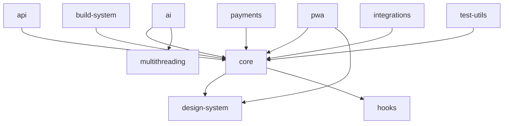

# Katalyst Turborepo Packages

Welcome to the comprehensive documentation for all custom Turborepo packages in the Katalyst framework. This documentation covers 12 core packages that power the Katalyst multi-monorepo microfrontend architecture.

## 📦 Package Overview

Katalyst is built on a modular package architecture that provides specialized functionality across different domains:

### Core Packages

| Package | Description | Version |
|---------|-------------|---------|
| [@katalyst/ai](./ai.md) | Production-ready AI agents with Claude Code Max integration | 1.0.0 |
| [@katalyst/api](./api.md) | Shared tRPC API layer for microfrontends | 1.0.0 |
| [@katalyst/core](./core.md) | Core React components, hooks, and utilities | 0.1.0 |
| [@katalyst/design-system](./design-system.md) | Comprehensive design token system and UI components | 0.1.0 |

### Platform & Build Packages

| Package | Description | Version |
|---------|-------------|---------|
| [@katalyst/build-system](./build-system.md) | Build configurations for web, desktop, mobile, and WebXR | 0.1.0 |
| [@katalyst/pwa](./pwa.md) | Progressive Web App capabilities with Workbox | 0.1.0 |

### Integration & Extension Packages

| Package | Description | Version |
|---------|-------------|---------|
| [@katalyst/hooks](./hooks.md) | Unified React hooks interface with 100+ hooks | - |
| [@katalyst/integrations](./integrations.md) | 35+ framework and tool integrations | - |
| [@katalyst/multithreading](./multithreading.md) | Rust-powered multithreading with Crossbeam, Rayon, and Tokio | 1.0.0 |

### Utility Packages

| Package | Description | Version |
|---------|-------------|---------|
| [@katalyst/payments](./payments.md) | Unified payment provider integrations | - |
| [@katalyst/test-utils](./test-utils.md) | AI-powered testing utilities and generators | - |
| [@katalyst/utils](./utils.md) | Web scraper and plugin utilities | 0.1.0 |

## 🏗️ Architecture Principles

### Monorepo Structure

All packages follow a consistent structure optimized for Turborepo:

```
packages/
├── ai/                  # AI agents and Claude integration
├── api/                 # tRPC API definitions
├── build-system/        # Build configurations
├── core/                # Core React utilities
├── design-system/       # Design tokens & components
├── hooks/               # React hooks
├── integrations/        # Framework integrations
├── multithreading/      # Rust-powered threading
├── payments/            # Payment integrations
├── pwa/                 # PWA features
├── test-utils/          # Testing utilities
└── utils/               # General utilities
```

### Package Dependencies



### Technology Stack

- **Runtime**: Deno (primary), Node.js (compatibility)
- **Framework**: React 19 with TanStack Router
- **Build Tools**: RSpack, Turborepo, NX
- **Type Safety**: TypeScript 5.3+ with Zod schemas
- **Testing**: Vitest with AI-powered test generation
- **Styling**: TailwindCSS with design tokens

## 🚀 Quick Start

### Installing Packages

All packages are published to the workspace and can be imported directly:

```typescript
// Import from any package
import { useKatalyst } from '@katalyst/hooks';
import { ThemeProvider } from '@katalyst/design-system';
import { threadController } from '@katalyst/multithreading';
import { createTRPCClient } from '@katalyst/api';
```

### Development Setup

```bash
# Install dependencies
make install

# Build all packages
make build

# Run tests
make test

# Start development mode with watch
make dev
```

### Package-Specific Commands

```bash
# Build specific package
turbo run build --filter=@katalyst/ai

# Test specific package
turbo run test --filter=@katalyst/core

# Watch mode for specific package
turbo run dev --filter=@katalyst/design-system
```

## 📚 Documentation Structure

Each package documentation includes:

1. **Overview** - Package purpose and key features
2. **Installation** - Setup and dependencies
3. **Quick Start** - Basic usage examples
4. **API Reference** - Complete API documentation
5. **Advanced Usage** - Complex patterns and best practices
6. **Integration** - How to use with other packages
7. **Examples** - Real-world usage examples
8. **Troubleshooting** - Common issues and solutions

## 🔧 Package Features by Category

### AI & Intelligence
- **[@katalyst/ai](./ai.md)**: Claude Code agents, thread management, WebSocket monitoring
- **[@katalyst/multithreading](./multithreading.md)**: Parallel processing, atomic operations, async runtimes

### UI & Design
- **[@katalyst/design-system](./design-system.md)**: Design tokens, theme system, UI components
- **[@katalyst/hooks](./hooks.md)**: Unified hook interface, 100+ React hooks
- **[@katalyst/integrations](./integrations.md)**: Arco Design, TailwindCSS, Storybook

### Data & API
- **[@katalyst/api](./api.md)**: tRPC routers, type-safe APIs, edge functions
- **[@katalyst/core](./core.md)**: Data fetching, state management, providers

### Platform & Build
- **[@katalyst/build-system](./build-system.md)**: RSpack, Webpack, Vite configs for all platforms
- **[@katalyst/pwa](./pwa.md)**: Service workers, offline support, installability

### Integration & Tools
- **[@katalyst/payments](./payments.md)**: Stripe, HyperSwitch, WalletConnect, crypto payments
- **[@katalyst/test-utils](./test-utils.md)**: AI test generation, visual regression, coverage analysis
- **[@katalyst/utils](./utils.md)**: Web scraping, MDX generation, plugin system

## 🎯 Common Use Cases

### Building a Full-Stack Application

```typescript
import { createTRPCClient } from '@katalyst/api';
import { useKatalyst } from '@katalyst/hooks';
import { ThemeProvider } from '@katalyst/design-system';
import { threadController } from '@katalyst/multithreading';

function App() {
  return (
    <ThemeProvider defaultTheme="system">
      <YourApp />
    </ThemeProvider>
  );
}
```

### Adding AI Capabilities

```typescript
import { ClaudeAgent, AgentConfig } from '@katalyst/ai';

const agent = new ClaudeAgent({
  apiKey: process.env.ANTHROPIC_API_KEY,
  model: 'claude-3-opus-20240229',
  maxTokens: 4096
});

const response = await agent.chat('Help me build a component');
```

### Implementing Multithreading

```typescript
import { threadController } from '@katalyst/multithreading';

await threadController.initialize({ rayonThreads: 4 });
const pool = threadController.createThreadPool('processing', { threads: 4 });
const results = await pool.map(data, 'transform');
```

### Setting Up Payments

```typescript
import { PaymentManager } from '@katalyst/payments';

const payments = new PaymentManager({
  providers: ['hyperswitch', 'walletconnect']
});

const result = await payments.processPayment({
  amount: 1000,
  currency: 'USD',
  provider: 'hyperswitch'
});
```

## 🔗 Related Documentation

- [Katalyst Core Framework](../../README.md)
- [API Documentation](../api/README.md)
- [Build System Guide](../build-system/README.md)
- [Integration Guides](../guides/integrations.md)

## 💡 Best Practices

1. **Import from Package Roots**: Always import from `@katalyst/package-name` rather than deep paths
2. **Use Type Safety**: Leverage TypeScript and Zod for runtime validation
3. **Follow Patterns**: Each package exports common patterns - use them!
4. **Check Examples**: Every package has examples - start there
5. **Leverage Turborepo**: Use `turbo run` for optimal caching and parallelization

## 🆘 Getting Help

- **Package Issues**: Check the package-specific troubleshooting section
- **API Questions**: Refer to the API Reference in each package doc
- **Examples**: Look at the examples directory in each package
- **Community**: Join our Discord or open a GitHub discussion

## 📝 Contributing

Each package welcomes contributions! Please see the main [Contributing Guide](../contributing/README.md) for:

- Development setup
- Testing requirements
- Documentation standards
- Pull request process

---

**Built with ❤️ by the Katalyst Team**
