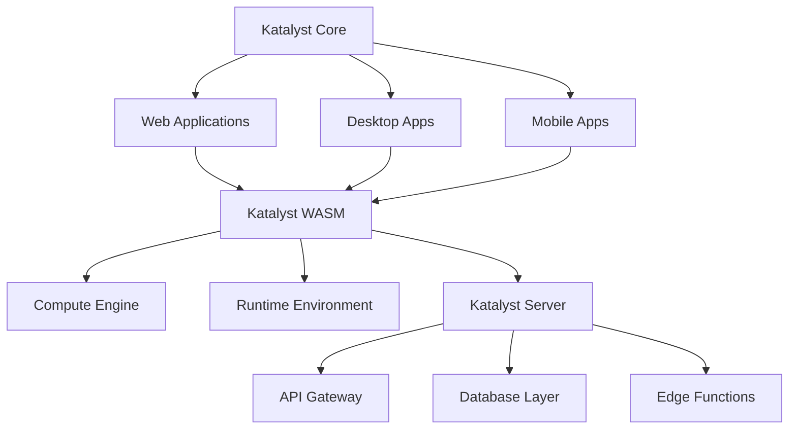

# Katalyst Framework Documentation

Welcome to the **Katalyst Framework** - a state-of-the-art multi-monorepo microfrontend architecture leveraging RSPack, Zephyr, and cutting-edge web technologies.

## Overview

Katalyst is a comprehensive framework consisting of three core components:

### 🚀 Katalyst Core
The TypeScript React core that powers the frontend applications with:
- **Multi-monorepo architecture** using NX and Turborepo
- **Microfrontend support** with Module Federation
- **RSPack & Zephyr** for ultra-fast builds
- **Progressive Web App** capabilities
- **WebXR & Metaverse** ready components

### 🦀 Katalyst WASM
The WebAssembly Deno runtime providing:
- **High-performance** computation
- **Secure sandboxed** execution
- **Cross-platform** compatibility
- **Native-like** performance in the browser

### ☁️ Katalyst Server
The backend infrastructure on Fly.io featuring:
- **Global edge deployment**
- **Auto-scaling** capabilities
- **Real-time** data synchronization
- **GraphQL & REST** API support

## Quick Start

```bash
# Clone the repository
git clone https://github.com/katalyst/katalyst-core

# Install dependencies
npm install

# Start development
npm run dev
```

## Architecture



## Key Features

- ⚡ **Lightning Fast** - RSPack powered builds
- 🎯 **Type-Safe** - Full TypeScript support
- 🔧 **Modular** - Microfrontend architecture
- 🌍 **Global** - Edge deployment ready
- 🔒 **Secure** - WebAssembly sandboxing
- 📱 **Cross-Platform** - Web, Desktop, Mobile
- 🎮 **WebXR Ready** - Metaverse capabilities
- 🤖 **AI Powered** - Integrated AI services

## Documentation Structure

This documentation is organized into the following sections:

1. **Getting Started** - Installation, setup, and quick start guides
2. **Core Concepts** - Architecture, design patterns, and principles
3. **API Reference** - Complete API documentation
4. **Guides** - Step-by-step tutorials and how-tos
5. **Examples** - Real-world examples and use cases
6. **Advanced Topics** - Performance, optimization, and scaling
7. **Migration** - Upgrading and migration guides
8. **Contributing** - How to contribute to Katalyst

## Community

- 📖 [Documentation](https://docs.katalyst.io)
- 💬 [Discord](https://discord.gg/katalyst)
- 🐦 [Twitter](https://twitter.com/katalystframework)
- 📝 [Blog](https://blog.katalyst.io)
- 🐛 [Issue Tracker](https://github.com/katalyst/katalyst-core/issues)

## License

Katalyst is open source software licensed under the MIT license.

---

*Built with ❤️ by the Katalyst Team*