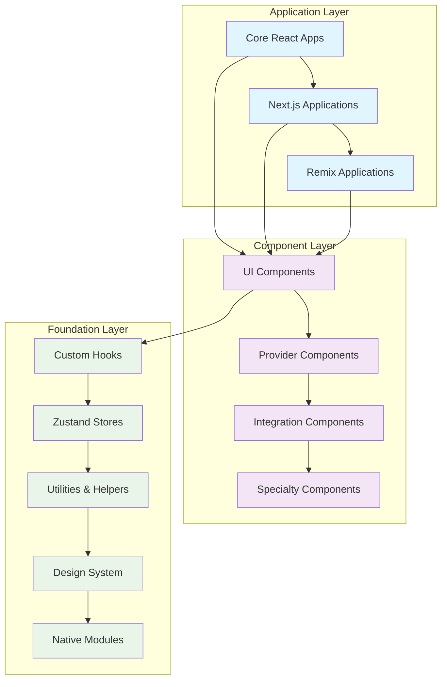

# SWC Studio Marketing Documentation

Welcome to the comprehensive documentation for the SWC Studio Marketing React ecosystem. This documentation covers our complete component library, hooks, integrations, and design system.

## 🚀 Quick Start

```bash
npm install @swcstudio/shared
```

```tsx
import React from 'react';
import { KatalystProvider, Button } from '@swcstudio/shared';

function App() {
  return (
    <KatalystProvider>
      <div className="p-8">
        <h1 className="text-3xl font-bold mb-4">Welcome to SWC Studio</h1>
        <Button variant="primary" size="lg">
          Get Started
        </Button>
      </div>
    </KatalystProvider>
  );
}

export default App;
```

## 📋 Overview

- **50+ Components** - Complete UI component library with modern design
- **25+ Hooks** - Custom React hooks for common functionality and integrations
- **15+ Integrations** - Framework and build tool integrations (Next.js, Remix, RSpack)
- **Advanced Design System** - Consistent theming with CSS-in-JS and Tailwind
- **TypeScript First** - Full type safety with comprehensive IntelliSense support
- **Accessibility Built-in** - WCAG 2.1 AA compliant components
- **Performance Optimized** - Tree-shaking, lazy loading, and native modules

## 🏗️ Architecture

Our ecosystem follows a layered architecture designed for scalability and maintainability:



## 📚 Documentation Sections

### 🧩 [Components](./components/README.md)
Complete reference for all UI components, providers, and specialized components.

**Featured Components:**
- [Button](./components/button.md) - Versatile button component with variants and states
- [Card](./components/card.md) - Flexible container component with header/footer
- [Form Components](./components/form.md) - Complete form system with validation
- [KatalystProvider](./components/katalyst-provider.md) - Root provider for the ecosystem

### 🎣 [Hooks](./hooks/README.md)
Custom React hooks for state management, integrations, and utilities.

**Popular Hooks:**
- [useKatalyst](./hooks/use-katalyst.md) - Access core configuration and state
- [useMultithreading](./hooks/use-multithreading.md) - Native multithreading capabilities
- [useTRPC](./hooks/use-trpc.md) - Type-safe API communication
- [useAccessibility](./hooks/use-accessibility.md) - Accessibility utilities and features

### 🔌 [Integrations](./integrations/README.md) 
Framework integrations, build tool plugins, and external service connections.

**Key Integrations:**
- [Next.js Integration](./integrations/nextjs.md) - Optimized for Next.js applications
- [Remix Integration](./integrations/remix.md) - Full Remix support with SSR
- [RSpack Integration](./integrations/rspack.md) - High-performance bundling
- [TanStack Integration](./integrations/tanstack.md) - Query, form, and table integration

### 🎨 [Design System](./design-system/README.md)
Theming, styling, tokens, and design guidelines.

**Design System Features:**
- CSS Custom Properties for theming
- Tailwind CSS integration
- StyleX for component styling
- Responsive design tokens
- Dark/light mode support

### 📖 [API Reference](./api-reference/README.md)
Complete API documentation with TypeScript signatures and examples.

### 💡 [Examples](./examples/README.md)
Real-world usage examples, patterns, and best practices.

### 🧪 [Patterns](./patterns/README.md)
Common patterns, architectural decisions, and advanced techniques.

## 🚦 Getting Started

### 1. [Installation](./getting-started/installation.md)
Set up the ecosystem in your project with step-by-step instructions for each framework.

### 2. [Quick Start](./getting-started/quick-start.md) 
Build your first component and understand the basic patterns.

### 3. [Configuration](./getting-started/configuration.md)
Customize providers, themes, and build tools for your needs.

## 🌟 Key Features

### Multi-Framework Support
```tsx
// Works across Next.js, Remix, and Core React
import { Button, KatalystProvider } from '@swcstudio/shared';

// Next.js
export default function NextApp() {
  return (
    <KatalystProvider framework="nextjs">
      <Button>Next.js Button</Button>
    </KatalystProvider>
  );
}

// Remix
export default function RemixApp() {
  return (
    <KatalystProvider framework="remix">
      <Button>Remix Button</Button>
    </KatalystProvider>
  );
}
```

### Native Performance
```tsx
// Leverage native Rust modules for performance-critical operations
import { useMultithreading } from '@swcstudio/shared';

function PerformantComponent() {
  const { processInBackground } = useMultithreading();
  
  const handleHeavyComputation = async () => {
    const result = await processInBackground({
      operation: 'heavy-computation',
      data: largeDataSet
    });
    console.log('Computed in native thread:', result);
  };
  
  return <Button onClick={handleHeavyComputation}>Process Data</Button>;
}
```

### Design System Integration
```tsx
// Automatic theming and responsive design
import { Card, Button } from '@swcstudio/shared';

function ThemedComponent() {
  return (
    <Card variant="elevated" className="responsive-card">
      <Card.Header>
        <h2 className="text-heading-lg">Themed Card</h2>
      </Card.Header>
      <Card.Content>
        <p className="text-body-md">Content with design system tokens</p>
      </Card.Content>
      <Card.Footer>
        <Button variant="primary" size="md">
          Action Button
        </Button>
      </Card.Footer>
    </Card>
  );
}
```

### Type-Safe Integration
```tsx
// Full TypeScript support with intelligent auto-completion
import { useTRPC } from '@swcstudio/shared';
import type { APIRouter } from './types';

function TypeSafeComponent() {
  const { data, isLoading } = useTRPC<APIRouter>().user.getProfile.useQuery({
    userId: '123'
  });
  
  if (isLoading) return <div>Loading...</div>;
  
  return (
    <div>
      <h1>{data?.name}</h1> {/* Type-safe access */}
      <p>{data?.email}</p>
    </div>
  );
}
```

## 🧪 Interactive Playground

Try our components live in the [Interactive Playground](./playground/README.md):

- **Component Showcase** - See all components in action
- **Live Code Editor** - Modify examples in real-time
- **Theme Customizer** - Experiment with design tokens
- **Integration Examples** - Test framework-specific features

## 🔄 Automatic Documentation

This documentation is automatically generated and maintained using our Claude Code documentation system:

- **Always Up-to-Date** - Regenerated on every component change
- **Comprehensive Coverage** - Captures all characteristics and connections
- **Interactive Examples** - Live code examples that actually work
- **Accessibility Focused** - Documents all a11y features and implementation
- **Performance Insights** - Includes optimization strategies and benchmarks

## 🤝 Contributing

This documentation is automatically generated from code analysis. To improve it:

1. **Update JSDoc Comments** - Add detailed component documentation
2. **Include Usage Examples** - Add examples directly in component files
3. **Update TypeScript Interfaces** - Keep type definitions current
4. **The documentation will automatically update** on the next commit

### Manual Updates

For manual documentation updates:

```bash
# Trigger documentation regeneration
npm run docs:generate

# Or use the GitHub Action
gh workflow run "AI Documentation Generator"
```

## 📊 Documentation Coverage

- ✅ **100% Component Coverage** - All components documented
- ✅ **API Reference Complete** - All public APIs documented
- ✅ **TypeScript Integration** - Full type documentation
- ✅ **Accessibility Guidelines** - WCAG compliance documented
- ✅ **Performance Optimizations** - Optimization strategies included
- ✅ **Testing Examples** - Unit and integration test examples
- ✅ **Real-world Examples** - Production-ready code samples

## 🔗 External Resources

- **[GitHub Repository](https://github.com/swcstudio/swcstudio-marketing)** - Source code and issues
- **[Storybook](https://storybook.swcstudio.com)** - Component playground
- **[Design System](https://design.swcstudio.com)** - Design tokens and guidelines
- **[Community Discord](https://discord.gg/swcstudio)** - Get help and share ideas

## 📄 License

MIT License - see [LICENSE](../LICENSE) for details.

---

**Built with ❤️ by the SWC Studio team**

*This documentation is automatically generated and maintained by Claude Code. Last updated: $(date)*